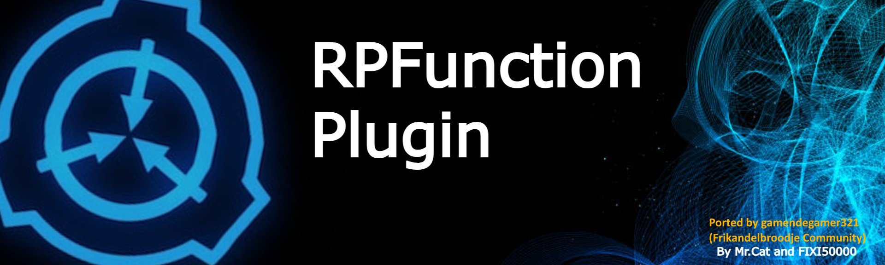

# About RPFunctions

This plugin adds RP events to the server. Configurable to your liking.

- Custom breach announcement when the round starts.
- Brings the femur breaker back.
- Roleplay commands for players and moderators.
- Omega warhead added to the Game. (requires RA access)
- Adds custom roles and items to the game.
- SCPs now have more realistic restrictions. (e.g. SCP-106 can't open doors)
- MTF & guards no longer have to worry about tesla gates.
- Players get upgraded in SCP-914, always resulting in death.

# Installation

> [!IMPORTANT]
> **Required dependencies:**
> - [FrikanUtils](https://github.com/FrikandelbroodjeCommunity/FrikanUtils/blob/master/FrikanUtils/README.md)
> - [FrikanUtils-ProjectMer](https://github.com/FrikandelbroodjeCommunity/FrikanUtils/blob/master/FrikanUtils-ProjectMer/README.md)
> - [ProjectMER](https://github.com/Michal78900/ProjectMER/releases/latest)

Install the dependencies listed above, and place
the [latest release](https://github.com/FrikandelbroodjeCommunity/RPFunctions-LabAPI/releases/latest) in the LabAPI
plugin folder.

The plugin requires the femur breaker & "hack device" to be provided as a schematic, download it from
the [releases page](https://github.com/FrikandelbroodjeCommunity/RPFunctions-LabAPI/releases/latest) and place it in the
correct folder. By default, this will be <code>LabAPI/configs/{port/global}/FrikanUtils/Maps/FemurBreaker.json</code>
and <code>LabAPI/configs/{port/global}/FrikanUtils/Maps/HackDevice.json</code>.

# Commands

| command        | Aliases  | Usage          | Command type    | Description                                                                              |
|----------------|----------|----------------|-----------------|------------------------------------------------------------------------------------------|
| `overload`     |          | `.overload`    | Console command | Can be used by SCP-079 once every round, will turn the lights of for 5 seconds.          |
| `escapeTool`   | `escape` | `.escape`      | Console command | Can be used by 1 scientist every round, grants them a facility manager keycard.          |
| `omegawarhead` |          | `omegawarhead` | RA command      | Can be used by moderators to start the omega warhead. Cannot be disabled after starting. |

# Screenshots

## Omega Warhead

## Custom Roles

## Custom Items

## Custom Commands

# Config

TODO: add the table...

# About the license

The original repository did not include a license file, thus this one does not include one either.
However, it did provide a link to the [MIT license](https://choosealicense.com/licenses/mit/).
